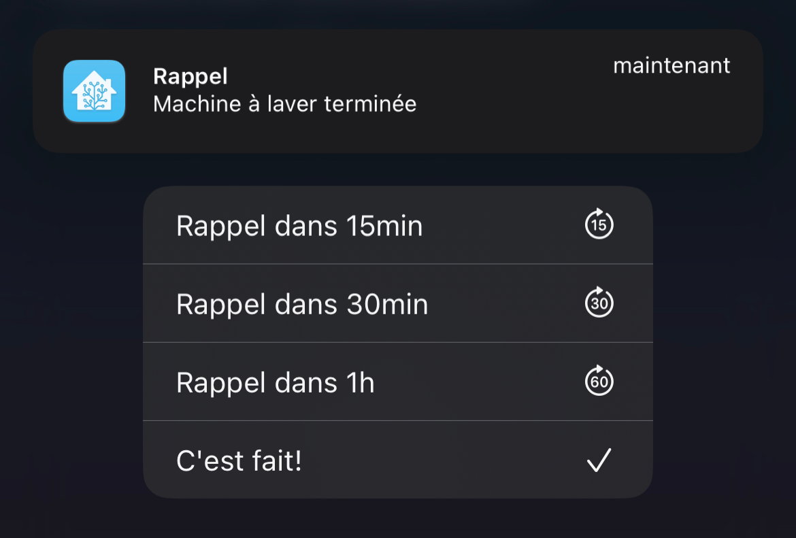

# Rappels d'événement via notifications Home Assistant

Le cas d'usage est d'avoir une notification lorsque le lave-linge est terminé, et des rappels tant que je n'ai pas confirmé que j'ai vidé le lave-linge. Les rappels peuvent être reportés de 15, 30 ou 60 min ou acquittés grâce à une liste de choix sur la notification.

## Principe

Cet ensemble d'automatisations permet d'envoyer sur l'application mobile Home Assistant des notifications qui contiennent 
une liste d'option pour programmer l'envoi d'une nouvelle notification au bout d'un temps donné en tant que rappel, tant que l'événement n'est pas acquitté.

Elles se basent sur le système de [notification "actionable" des Apps Companion](https://companion.home-assistant.io/docs/notifications/actionable-notifications/) Home assistant. Mais n'importe quel événement peut servir de point de départ en tant que trigger d'une automatisation.

Le système s'appuie également sur un [timer Home Assistant](https://www.home-assistant.io/integrations/timer/) pour gérer le temps avant qu'un rappel ne survienne.

Les timers peuvent être créés avec l'aide des helpers Home Assistant, accessible directement pour votre instance ici :

## Fonctionnement

Le système est composé de 3 automations :

- [RepeatableNotification-ApplianceEndCycle.yml](RepeatableNotification-ApplianceEndCycle.yml)
- [RepeatableNotification-Reminder.yml](RepeatableNotification-Reminder.yml)
- [RepeatableNotification-TimerManagement.yml](RepeatableNotification-TimerManagement.yml)

### RepeatableNotification-ApplianceEndCycle

Cette automation démarre la chaine sur un événement quelconque que l'on veut se voir rappeler. Dans mon example, dans l'automation, le blueprint [Notify or do something when an appliance like a dishwasher or washing machine finishes](https://community.home-assistant.io/t/notify-or-do-something-when-an-appliance-like-a-dishwasher-or-washing-machine-finishes/254841) est utilisé. L'action lancée par le blueprint fait deux choses en parallèle :
- lancer le timer pour une durée de 15min
- envoyer une notification avec 4 options 
  - Rappel dans 15 min
  - Rappel dans 30 min
  - Rappel dans 60 min
  - Confirmer que le lave-linge est vidé.

### RepeatableNotification-Reminder

Cette automation est déclenchée par la fin du timer.
L'action lancée dans l'automation fait exactement les 2 mêmes actions que pour la première automation, à savoir deux choses en parallèle :
- relancer le timer pour une durée de 15 min, au cas ou on ne réagirait pas à cette notification, elle sera renvoyée 15 min après.
- envoyer une notification avec 4 options 
  - Rappel dans 15 min
  - Rappel dans 30 min
  - Rappel dans 60 min
  - Confirmer que le lave-linge est vidé.

### RepeatableNotification-TimerManagement

Cette automation réagit aux actions faites sur le téléphone en réponse à la notification, pour soit :
 - relancer le timer pour la durée voulu afin de faire renvoyer une notification via l'automation `EndCycle-Reminder`
 - arrêter le timer pour confirmer que le lave-linge est vidé, et ainsi ne plus recevoir de notification jusqu'au prochain événement qui déclenche l'automation `EndCycle-ApplianceEndCycle`.

## Limitations

Sur Android (non testé) le nombre d'action semble limité à 3. Il faudra donc supprimer un des choix possibles sur la durée du rappel.

Sur iPhone, pour afficher la liste d'option il faut maintenir un appui sur la notification pour faire apparaître la liste des options. Un simple tap ouvre Home Assistant et fait disparaître la notification.